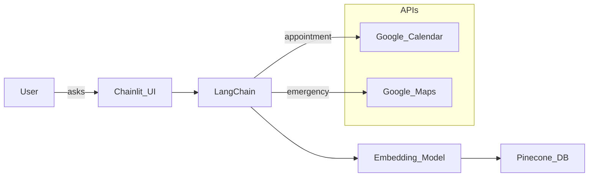

# 🧠💉 MedGuideAI: Your AI-Powered Healthcare Assistant

*"An intelligent companion for your health journey."*

Revolutionizing healthcare with AI-driven insights, appointment scheduling, and emergency response.

---

## 🔍 What is MedGuideAI?

**MedGuideAI** is a next-gen, AI-powered healthcare assistant that answers medical queries, books appointments with doctors, and guides you to the nearest hospital in emergencies — all through a conversational interface.

Built using **LangChain**, **Hugging Face Embeddings**, **Pinecone**, **Google APIs**, and **Chainlit** to deliver a seamless patient experience.

---

## 🚀 Key Features

| Capability                  | Description                                                        |
|-----------------------------|--------------------------------------------------------------------|
| 🩺 Medical Q&A              | Retrieves answers from medical PDFs using semantic search           |
| 📅 Doctor Appointment       | Checks doctor availability and books appointments via Google Calendar|
| 🚑 Emergency Routing        | Finds nearest hospitals and navigates using Google Maps             |
| 💬 AI Chat Interface        | Built with Chainlit for clean and conversational interactions       |

---

## 🏗️ Project Architecture



---

## ⚙️ Getting Started

### 🔧 Prerequisites

- Python 3.8+
- Google Cloud API Key
- Pinecone API Key
- Hugging Face Token (for embeddings)

### 📥 Installation

```bash
git clone https://github.com/Poojitha319/MedGuideAI.git
cd MedGuideAI
pip install -r requirements.txt
```

### 🔐 Set Environment Variables

Create a `.env` file or set them in your terminal:

```bash
export PINECONE_API_KEY="your_pinecone_api_key"
export GOOGLE_API_KEY="your_google_api_key"
export GOOGLE_MAPS_API_KEY="your_google_maps_api_key"
export HUGGINGFACEHUB_API_TOKEN="your_huggingface_token"
```

---

## 🩻 How It Works

### 🧠 Medical Information Retrieval

- Upload PDF medical resources.
- Questions are semantically searched using LangChain + Pinecone.
- Responses are context-aware and relevant.

### 🩺 Doctor Appointment Scheduling

- Integrated with Google Calendar API.
- Users can:
  - 🔍 Check doctor availability
  - ✅ Book slots
  - 🔔 Get reminders

### 🚨 Emergency Routing System

- Get nearest hospitals using Google Maps + Places API.
- View:
  - 📍 Directions
  - 🕒 Estimated time
  - 🚘 Route on map

### 💬 Chat Interface (Chainlit)

- Built using Chainlit for fast prototyping.
- Intuitive and interactive.

To run:

```bash
chainlit run app.py -w
```

---

## 📦 Directory Structure

```
MedGuideAI/
├── app.py               # Main Chainlit app
├── utils/               # Modular utilities (calendar, maps, QnA)
├── content/             # PDF data source
├── .env                 # API keys
├── requirements.txt
└── README.md
```

---

## 🔮 Future Roadmap

- 💊 Medication Reminders
- 📂 Medical Record Integration
- 🤒 Symptom Checker
- 🔒 HIPAA/GDPR Compliance

---

## 🧑‍🔬 Use Cases

- Healthcare Startups 🏥
- Personal Health Monitoring 📋
- Elderly Care Solutions 👵👴
- Rural/Remote Medical Access 🌐

---

## 📄 License

This project is licensed for research and educational use.

---

## 🤝 Contributions

We welcome contributions! Feel free to open issues or submit PRs for improvements, new features, or bug fixes.
